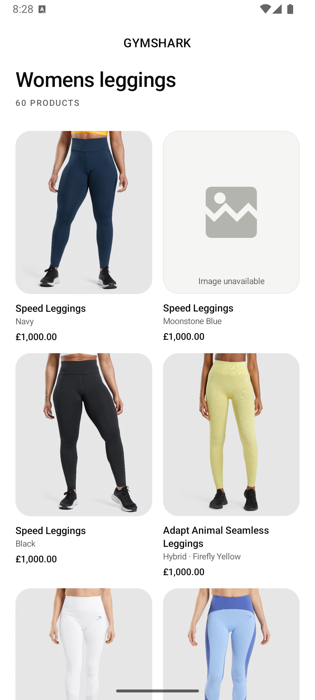
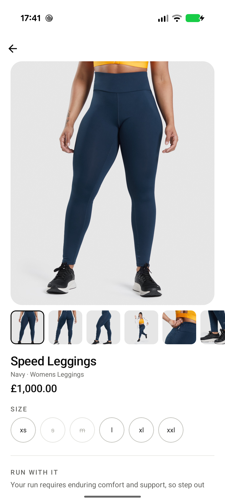
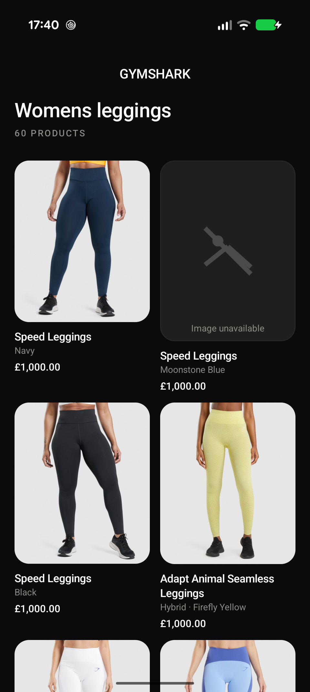
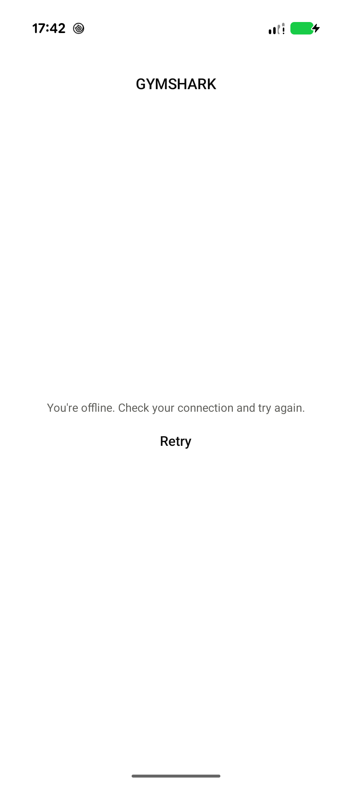
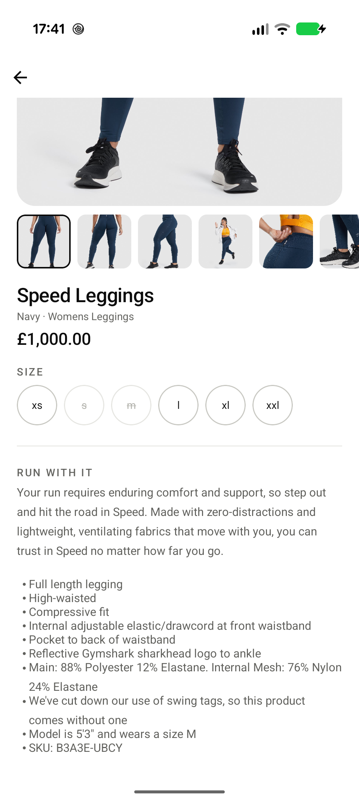

# Gymshark — Mobile Engineering Challenge

An Android product catalogue built against the supplied Algolia payload: a product grid with
label indicators, a detail screen, and the HTML product description rendered properly.

Jetpack Compose · MVVM · Navigation 3 · Hilt · Coil 3 · Kotlin

---

## Screens

Real screenshots, taken from the app running on a physical Pixel 9 Pro against the live
payload — not mockups.

| Product list | Product detail | Dark |
|---|---|---|
|  |  |  |

The list screenshot above shows the **image-error placeholder** for real — one fixture
product points at a dead URL (see "Proving robustness" below), so it's visible without
reading a test.

| Offline |
|---|
|  |

Captured by disabling Wi-Fi and mobile data on the device and force-relaunching the app.
**Loading and Empty are not captured**: Loading resolves too fast against this endpoint to
screenshot reliably, and Empty is unreachable against the real payload (60 hits, always) —
both are exercised by the unit suite instead, not by a device screenshot.

---

## The HTML description

The payload's `description` is a Shopify/TinyMCE field that someone pasted out of Microsoft
Word. It arrives like this:

```html
<meta charset="utf-8">
<p data-mce-fragment="1"><strong data-mce-fragment="1">RUN WITH IT</strong></p>
<p data-mce-fragment="1">Your run requires enduring comfort…</p>
<p data-mce-fragment="1">- Full length legging<br data-mce-fragment="1">- High-waisted…</p>
<span data-mce-fragment="1" class="TextRun SCXP103297068 BCX0">5'3" and wears a size M</span>
```

It is sanitised by a pure, unit-tested function and rendered with
`AnnotatedString.fromHtml`, so `<strong>` becomes a heading and the `<br>`-delimited run
becomes a real bullet list — this is the actual detail screen, scrolled to the description:



No WebView. Sanitising is load-bearing rather than cosmetic — `fromHtml` silently ignores
tags it doesn't recognise.

---

## Running it

```bash
./gradlew installDebug          # install
./gradlew test                  # JVM unit tests
./gradlew connectedCheck        # instrumented tests (device required)
./gradlew koverHtmlReport       # coverage report
```

There is no snapshot-testing layer — Paparazzi's Gradle plugin is incompatible with the AGP
version Hilt requires; see [DESIGN.md](docs/DESIGN.md) §8 for what replaced it.

Benchmarks require a **physical device** and a release build:

```bash
./gradlew :macrobenchmark:connectedBenchmarkReleaseAndroidTest
```

Minimum SDK 26. No API keys or local configuration required.

---

## Assumptions

Stated rather than buried, because the payload is ambiguous in places.

1. **`price` and `compareAtPrice` are in major units, not minor units.** `1000` renders as
   £1,000.00, `65` as £65.00. The real payload has 54 products at exactly `1000` and six at
   `50`/`60`/`65` — under a minor-units reading those six become £0.50/£0.60/£0.65, which
   isn't plausible for leggings; under major units they're £50/£60/£65, which is. `1000`
   then looks like an unset default on the other 54 products, but it is **rendered as
   supplied — £1,000.00 — not special-cased**, since guessing at what a placeholder "should"
   mean would be inventing behaviour the API doesn't state. The scale is a single named
   constant, so reversing this reading is a one-line change, and both interpretations are
   covered by tests.
2. **Currency is GBP**, formatted via `NumberFormat` — the API supplies no currency code.
3. **The six observed label values split into two categories.** Merchandising
   (`going-fast`, `new`, `limited-edition`, `popular`) renders as the existing image badge;
   sustainability (`recycled-nylon`, `recycled-polyester`) renders as material chips on the
   detail screen. One product carries both — `new` plus both recycled labels — which the
   split resolves without a stacking or "+2" affordance. An unrecognised future label
   defaults to the merchandising `Unknown(raw)` branch rather than being dropped or
   crashing.
4. **`discountPercentage` is displayed as supplied**, never recalculated — recomputing risks
   disagreeing with the merchandiser's own figure. **`compareAtPrice` and
   `discountPercentage` are `null` on all 60 products in this payload**, so the sale price,
   strikethrough and discount badge are implemented and unit-tested against constructed
   fixtures but not observable by running the app against the live payload. Kept rather than
   cut: unlike an affordance such as "Add to bag", which has no schema backing at all, this
   is genuine handling of a real, nullable payload field that simply isn't populated in this
   particular dataset — the same treatment already given to `fit`, which is null on 58 of
   60 products.
5. **The endpoint is read-only and unauthenticated.**

---

## What was deliberately left out

The brief asks for a product list, a detail screen, and the description rendered
appropriately. That is what this is.

No bottom navigation, no "Add to bag", no favourites, no search. Each would have been an
affordance with nothing behind it, and a button that does nothing is worse than a button
that isn't there. **Nothing on screen is inert** — every element is backed by payload data or
real behaviour.

The one thing that might look like scope creep is the **size chips**, and they earn their
place: `availableSizes` carries genuine per-size `inStock` data, so rendering it — including
out-of-stock sizes as disabled — is product information the brief asks the detail screen to
show. Selection is local state and claims nothing more.

---

## Proving robustness against an endpoint that never fails

The supplied URL is a static CDN file. It cannot return 500, cannot time out, cannot return
an empty result. The brief nonetheless asks for handling of incorrect and missing images and
an error-free experience, so failure is demonstrated deliberately:

- **MockWebServer suite** covering HTTP 500, socket timeout, malformed JSON, truncated
  bodies and `{"hits": []}` — each asserted end-to-end through repository → ViewModel →
  the correct typed `UiState`.
- **One fixture product points at a dead image URL**, so the error placeholder is visible on
  first launch without reading a single test — deliberate and fixed by product ID, not left
  to chance (a few of the payload's real image URLs also happen to 404 right now, but that's
  incidental and could change without warning; see `ProductMapper.kt`).
- **Process death** is handled and verified: the selected size survives via `SavedStateHandle`, scroll position via `rememberSaveable`, and the detail screen refetches when the in-memory cache is gone
  rather than restoring to a blank screen.

---

## Next steps, deliberately deferred

Choices with reasons, not a list of unfinished work:

- **Colourway grouping.** The sixty `hits` are twenty-one products in sixty colours — `Adapt
  Camo Seamless Leggings` and `WTFlex Seamless High Waisted Leggings` each appear six times,
  and `handle` encodes the variant (`gymshark-speed-leggings-navy-ss22`). The list ships flat
  because that is what the search endpoint returns; grouping into one card with colour
  swatches would mean inventing a product model the API does not express.
- **Adaptive two-pane layout** for tablets and foldables. Navigation 3 makes this
  inexpensive; omitted for time rather than for doubt.
- **Disk cache**, so a first launch while offline shows content rather than an error state.
- **Field performance monitoring** — Play Vitals plus RUM attribution by screen and device
  tier, which is what this tooling is for at production scale.

---

## Performance

Baseline Profile generated with `BaselineProfileRule`; scroll and startup measured with
Macrobenchmark on a physical Pixel 9 Pro.

| Product grid scroll | No profile | Baseline Profile |
|---|---|---|
| `frameOverrunMs` P95 | -8.59 ms | -8.86 ms |
| Dropped frames (overrun > 0) | 3 / 2348 (0.13%) | 3 / 2391 (0.13%) |

Every percentile is negative in both modes — on this device, the real 60-product grid
scroll never approaches its frame deadline, with or without the profile. Startup did
improve measurably: median `timeToInitialDisplayMs` went from 173.08 ms to 159.24 ms
(-8.0%), and median `timeToFullDisplayMs` — the point the product grid actually
renders, not just the loading spinner's first frame — from 445.19 ms to 422.43 ms
(-5.1%), both with the profile applied.

Full method and the measure → diagnose → fix → re-measure write-up are in
[PERFORMANCE.md](docs/PERFORMANCE.md).

---

## Testing

| Layer | Tool | Covers |
|---|---|---|
| Unit | JUnit 5, Turbine, MockWebServer | Mappers, `Money`, `Label`, `HtmlSanitiser`, ViewModel state machines, error paths |
| Instrumented | Compose + JUnit 4 | List→detail navigation, back with scroll restored, error retry |

**No snapshot-testing layer** — Paparazzi's Gradle plugin is incompatible with the AGP
version Hilt's Gradle plugin hard-requires, and both cannot be satisfied at once. The two
checks a golden would have covered — bullet rendering and RTL mirroring — are instead
one-off manual on-device checks, recorded in [DESIGN.md](docs/DESIGN.md) §7–8. Everything
else the matrix would have covered (light/dark theming, label badge treatments, remaining
font-scale reflow) has no remaining visual coverage — named as a gap rather than left for a
reviewer to discover.

Hand-written fakes throughout — no mocking library. Test fixtures come from the **real
committed payload**, so mappers are exercised against genuine data rather than a tidied
approximation of it.

**Kover line coverage** (`./gradlew koverHtmlReport`, reported but not gated):

| Module | Line coverage |
|---|---|
| `:core:model` | 86.2% (100/116) |
| `:core:data` | 98.0% (96/98) |

A gate would invite tests written to move a number rather than to catch a defect. What is
deliberately untested — and why — is listed in [ARCHITECTURE.md](docs/ARCHITECTURE.md) §9.6.

---

## Accessibility

Two verification passes that no automated layer can honestly cover (§8 of `DESIGN.md` — no
snapshot layer exists to pin either), both on a physical device rather than an emulator:

- **RTL mirroring — done.** `adb shell settings put global debug.force_rtl 1` (a full `adb
  reboot` is needed for it to actually propagate) confirmed full mirroring, including the
  `AutoMirrored` back icon. This check found a real bug: `android:supportsRtl` was missing
  from `AndroidManifest.xml` entirely, so the app silently rendered LTR-only despite every
  modifier already correctly using `start`/`end`. Fixed, then reverified.
- **TalkBack pass — done.** Run on the physical Pixel 9 Pro (Settings → Accessibility →
  TalkBack), swiping through the product list, a product card, and the detail screen.
  Images, badges and prices are announced with the same meaning they visually convey, and
  reading order matches visual order.

---

## Documentation

| Document | Contents |
|---|---|
| [ARCHITECTURE.md](docs/ARCHITECTURE.md) | Module structure, DI, state modelling, data layer, navigation, testing strategy, state restoration — each decision with its rejected alternatives |
| [DESIGN.md](docs/DESIGN.md) | Colour and type tokens, component specs, accessibility, what replaced the snapshot-testing layer |
| [PERFORMANCE.md](docs/PERFORMANCE.md) | Benchmark method, results, what production monitoring would look like |
| [CONVENTIONS.md](docs/CONVENTIONS.md) | Git strategy, build setup, static analysis, code style |

Each records not just what was chosen but what was rejected, and why.
